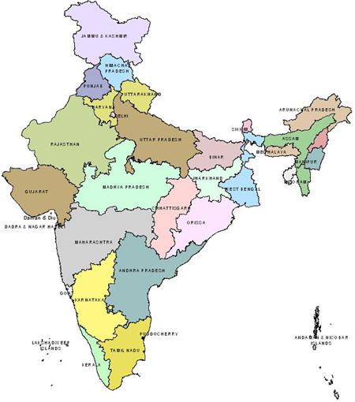

# 🗺️ **Hotspot Locator** 📍

Welcome to the **Hotspot Locator** project! This interactive web application allows users to explore various states in India through an image map. Click on the hotspots to learn more about each state.

## 🚀 **Features**

- **Interactive Image Map**: Click on different regions to view detailed information.
- **Detailed State Information**: Get insights on area, population, economy, and tourism.
- **Responsive Design**: Works seamlessly on both desktop and mobile devices.

## 📸 **Screenshot**



## 🌟 **Tech Stack**

- **HTML**: Structure of the web pages
- **CSS**: Styling and layout


## 🌐 **Demo Image**

Check out the Demo Images here.


## 📁 **File Structure**

```plaintext
.
├── image/
│   └── India_map.jpg
├── index.html
├── bihar.html
├── gujarat.html
├── andhra.html
└── style.css
```

## 🔗 **Link**

- [GitHub Repository](https://github.com/BlackEmpir7199/220701216-CS19542-IP-Lab)

---
Made by **👨‍💻Rakhul**.